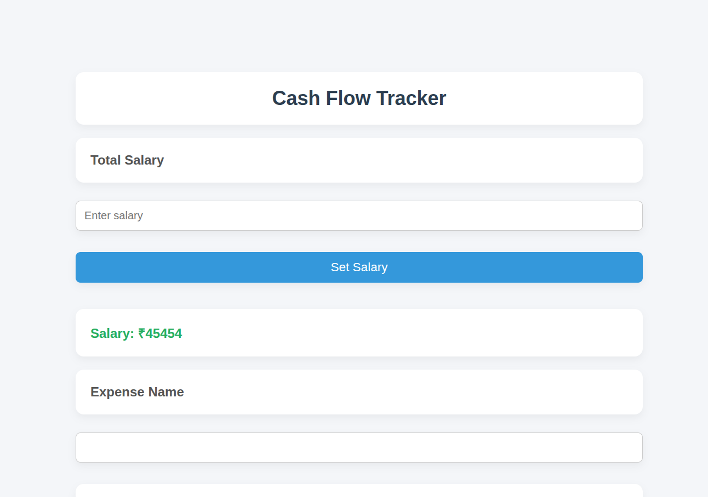
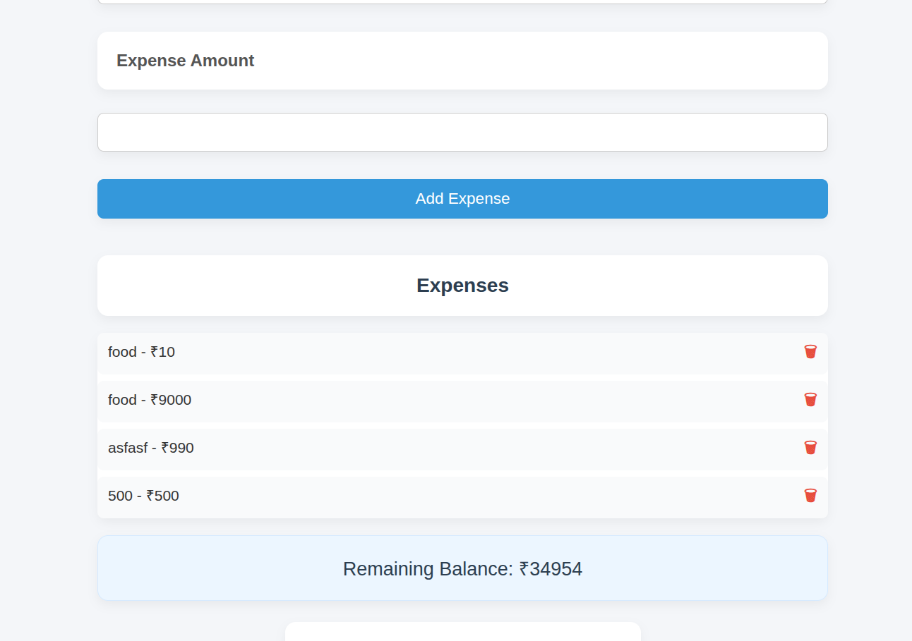
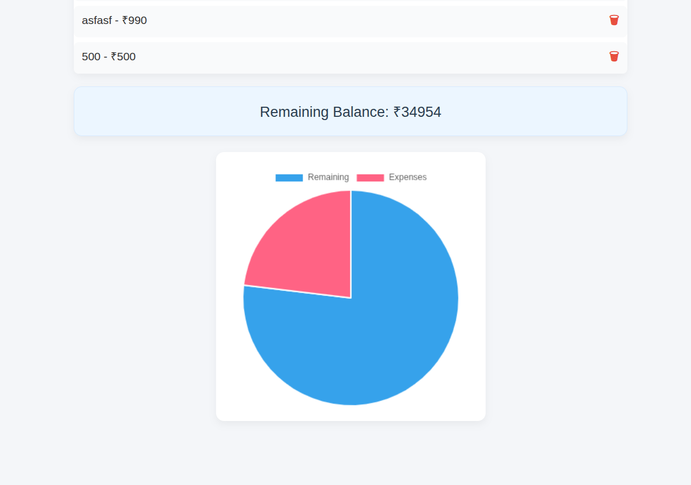

# Cash Flow Tracker – Salary & Expense Dashboard

A simple web-based application that allows users to track salary, expenses, and remaining balance dynamically using Vanilla JavaScript.

This project is developed as part of **Prodesk IT – Week 2 Mission (JavaScript Logic)**.

## Project Details

- **Project Name:** Cash Flow Tracker
- **Intern Name:** Manisha
- **Internship Program:** Prodesk IT
- **Week:** 2
- **Theme:** JavaScript Logic, DOM Manipulation & Data Persistence
- **Difficulty Level Completed:** Level 1 and Level 2

## Objective

To build a functional dashboard where a user can:

- Input their salary
- Add expenses
- See remaining balance update in real time
- Persist data using LocalStorage
- Visualize expense distribution using charts

This project focuses on mastering core JavaScript concepts without using any frameworks.

## Features Implemented

### Level 1

- Salary input field
- Add expense with name and amount
- Real-time balance calculation
- Input validation
- Dynamic UI updates

### Level 2

- Data persistence using LocalStorage
- Delete individual expenses
- Pie chart visualization using Chart.js

### Level 3 (Future Scope)

- PDF export
- Currency conversion
- Budget alert system

## Tech Stack

- HTML
- CSS
- Vanilla JavaScript
- Chart.js (via CDN)
- Browser LocalStorage

## Project Structure

```
/project-folder
│
├── index.html      # Main structure and CDN links
├── index.js        # JavaScript logic
├── style.css       # Styling
├── prompts.txt     # AI usage documentation
└── README.md       # Project documentation
└── resources/      # screenshots and videos
```

## How to Run the Project

1. Clone or download the repository.
2. Open the `index.html` file in any modern web browser.
3. No server or build tools are required.

## Screenshots and Demo

Add your screenshots and demo video links here.

Example:

- Home Page Screenshot:
  
- Expense List Screenshot:
  
- Chart View Screenshot:

<!-- - Demo Video Link:
  (insert link here) -->

## Learning Outcomes

Through this project, I learned:

- DOM manipulation using Vanilla JavaScript
- Handling user events and form inputs
- Managing application state without frameworks
- Persisting structured data using LocalStorage
- Integrating external libraries using CDN
- Handling data type conversion in JavaScript

## Limitations

- No backend or authentication system
- Data is stored only in the browser
- UI is minimal since the focus is on logic

## Future Improvements

- Add PDF export functionality
- Add currency conversion
- Implement budget alerts
- Improve UI/UX
- Backend integration

## Declaration

I confirm that this project is built by me as part of the Prodesk IT internship and follows the given project guidelines.
